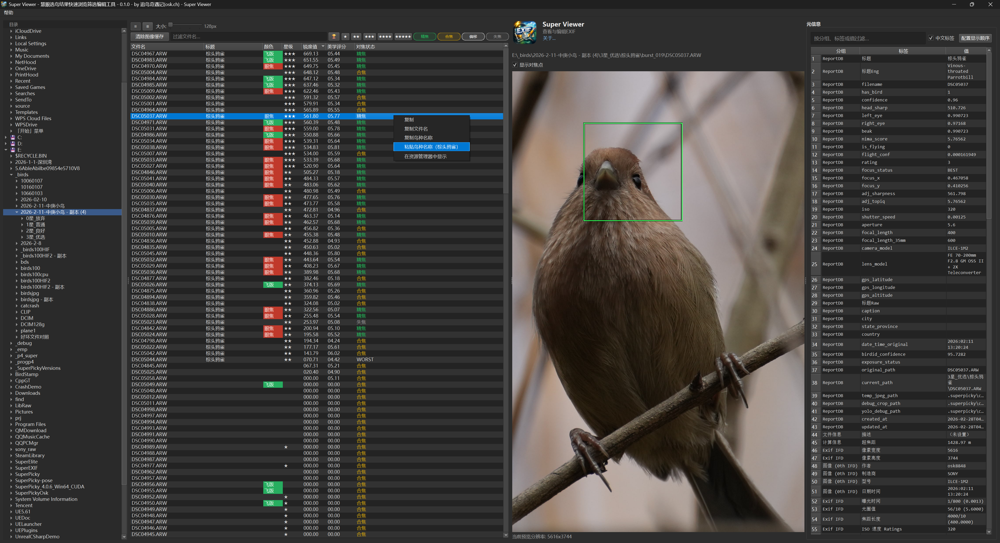
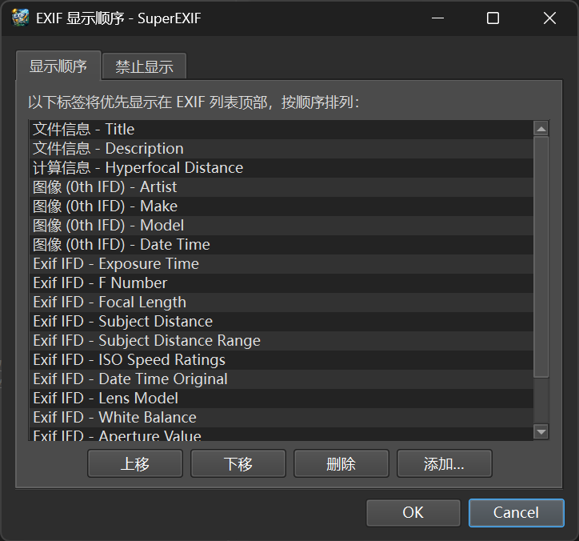
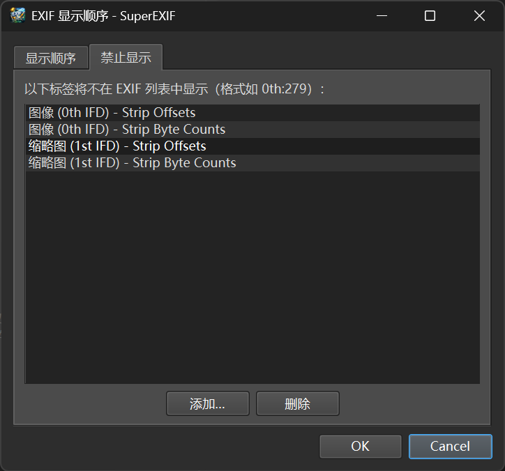

# Super Viewer - 图片 EXIF 查看器/编辑器
适合通过`慧眼选鸟(4.1.0及后继版本)`处理后，不需要LRC、PS流程处理照片的情况

* V0.1.0版本功能
  * 选中`慧眼选鸟`处理过的目录会自动读取数据库并可过滤显示
  * 支持从`慧眼选鸟`发送文件到本应用
  * 支持发送文件到`Super Birdstamp`切图工具
    * https://github.com/OscarKing888/SuperBirdStamp.git
  * 支持星级、文件名、精选（奖杯）过滤
  * 文件列表可排序
  * 右键菜单可复制粘贴鸟名，并写入数据库
  * 实际文件路径与数据库不一致的会自动修正数据库中的文件路径
  * 支持自定义显示顺序，支持自定义标签名称。
  * 支持常见的照片格式（如 各种RAW/JPEG/TIF/HEIC/HEIF）。    
  * `文件信息-标题` 与 `文件信息-描述` 支持直接双击编辑并写回元数据。
  * 额外增加了超焦距计算，公式为 H = f^2 / (N * c) + f，其中 f=焦距(mm), N=光圈值, c=弥散圆(mm)。

* 主界面

* 自定义显示顺序

* 自定义隐藏标签

# 关于作者
小红书 @追鸟奇遇记 https://xhslink.com/m/A2cowPsYj8P

# 友情链接：慧眼选鸟
* 官网：https://superpicky.app

* 小红书 @詹姆斯摄影 https://xhslink.com/m/3UWGeUJqUi0

*开源库：https://github.com/jamesphotography/SuperPicky

# License

本仓库根目录代码与文档在未另行说明时，按 `GNU Affero General Public License v3.0 (AGPL v3.0)` 发布，详见 `LICENSE`。

仓库中包含独立子模块与第三方组件时，这些内容仍以其各自上游许可证为准，不因本仓库根目录 `LICENSE` 自动变更。相关边界说明见 `THIRD_PARTY_NOTICES.md`。
