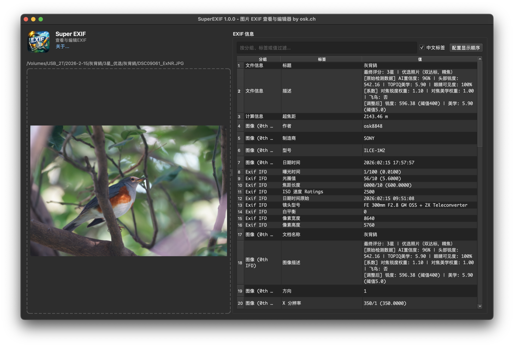
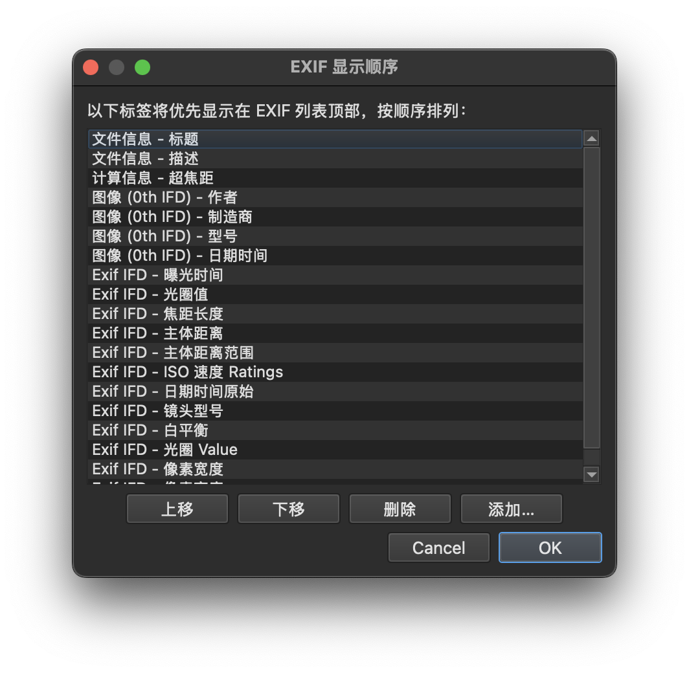

# SuperEXIF - 图片 EXIF 查看器/编辑器

* 选中慧眼选鸟处理过的目录会自动读取数据库并可过滤显示
* 右键菜单可复制粘贴鸟名，并写入数据库
* 实际文件路径与数据库不一致的会自动修正数据库中的文件路径
* 支持自定义显示顺序，支持自定义标签名称。
* 支持常见的照片格式（如 各种RAW/JPEG/TIF/HEIC/HEIF）。    
* `文件信息-标题` 与 `文件信息-描述` 支持直接双击编辑并写回元数据。
* 额外增加了超焦距计算，公式为 H = f^2 / (N * c) + f，其中 f=焦距(mm), N=光圈值, c=弥散圆(mm)。

* 主界面

* 自定义显示顺序

* 自定义隐藏标签

# 关于作者
小红书 @追鸟奇遇记 https://xhslink.com/m/A2cowPsYj8P

# 友情链接：慧眼选鸟
小红书 @詹姆斯摄影 https://xhslink.com/m/3UWGeUJqUi0
开源库：https://github.com/jamesphotography/SuperPicky
